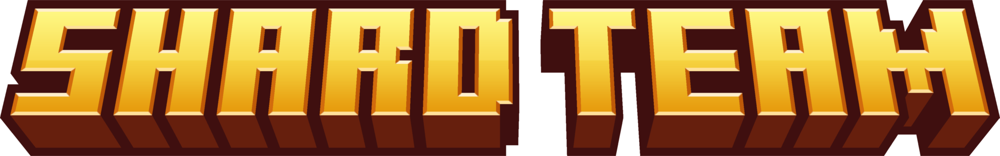
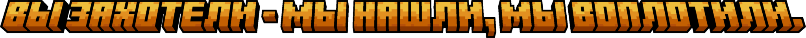

# Главная страница | Shard Team

<figure><figcaption></figcaption></figure>

<figure><figcaption></figcaption></figure>

***

> «Лучше посрать и опоздать, чем успеть и обосраться.» - ©Джейсон Стетхем
>
> P.S. это одна из причин долгой разработки.

***

## Кто мы такие?

**Shard Team** - команда создания игровых серверов Minecraft создающая развлекательный контент и дружественное комьюнити игроков СНГ, в основном игроков из Украины, России, и в целом говорящих на русском языке.&#x20;


**ЛЮБЫЕ МЕЖРАССОВЫЕ КОНФЛИКТЫ У НАС ЗАПРЕЩЕНЫ И ЖЕСТОКО НАКАЗЫВАЮТСЯ АДМИНИСТРАЦИЕЙ ПРОЕКТА СЕРВЕРА И ГЛАВНЫМ СОСТАВОМ!**


***

## Почему мы?

Мы не принуждаем вас играть, лишь просим поддержать проекты если у вас есть возможность и желание. Для нас важны игроки и в вас - наш приоритет. Маленький онлайн - не признак нашего бездействия, всё зависит от вас и если у вас есть желание - вы можете играть и звать друзей, наша главная администарция это будет только поощерять! Мы рады всем игрокам кто к нам заходит.

***

## Как попасть на наши проекты?

Если у вас есть желание поиграть на проекте - вы можете в нужном канале подать заявку на проходку (иногда они могут быть платные, это будет расписано на отдельной странице, либо в соответсвующем канале Discord). Перед этим прочитайте правила т.к. будет устный опрос по некоторым из них, это осуществляется чтобы убеиться что вы ознакомлены с ними и не будете специально нарушать их. Все подробности будет оглашать администрация.

***

## Проекты в настоящее время (кратко).



<figure><figcaption></figcaption></figure>

Проект основанный в **августе 2024г.** как сервер для мини-игр, а позже как сервер с модами. В будующем планируется открыть звено с BedWars и т.д.&#x20;

**Является основным и главным по управлению остальными проектами.**



Информация в данный момент отсутвует пока проект не будет в строю



***

<h2 align="center">Присоединяйтесь к нам и нашему комьюнити, станьте частичкой чего-то большего!</h2>

<table data-card-size="large" data-view="cards"><thead><tr><th></th><th></th><th></th><th align="center"></th><th data-hidden data-card-cover data-type="image">Cover image</th></tr></thead><tbody><tr><td><h4><i class="fa-discord">:discord:</i></h4></td><td><strong>Discord сервер</strong></td><td>Присоеденяйтесь к нашему основному проекту в Discord! Больше о нём вы можете почитать на странице Game Shard.</td><td align="center"><a href="https://discord.gg/zrhPyw7pKb" class="button primary" data-icon="computer-mouse-button-left">Присоедениться к Discord.</a></td><td><a href=".gitbook/assets/discord_prev.png">discord_prev.png</a></td></tr><tr><td><h4><i class="fa-github">:github:</i></h4></td><td><strong>GitHub репозитории</strong></td><td>Вы всегда можете посмотреть все сборки в репозитории GitHub, а так-же кастомные скрипты/моды (в будующем).</td><td align="center"><a href="https://www.gitbook.com/" class="button primary" data-icon="computer-mouse-button-left">Открыть репозитории.</a></td><td><a href=".gitbook/assets/git_prev.png">git_prev.png</a></td></tr></tbody></table>
