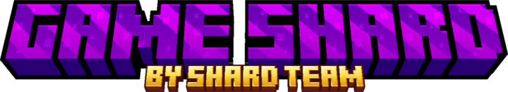
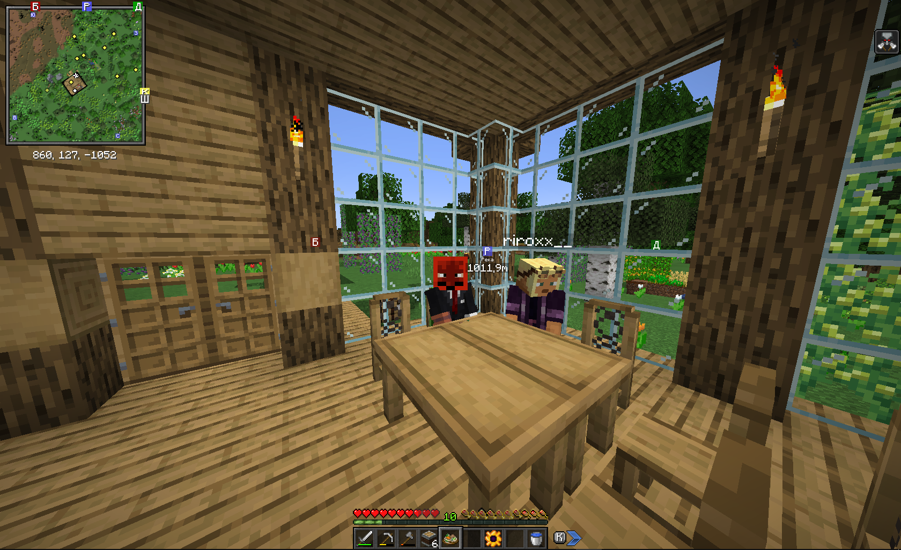
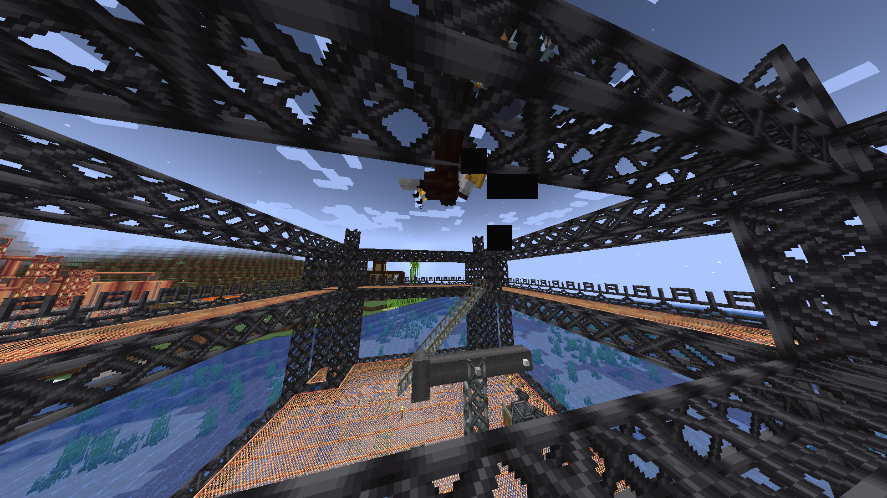
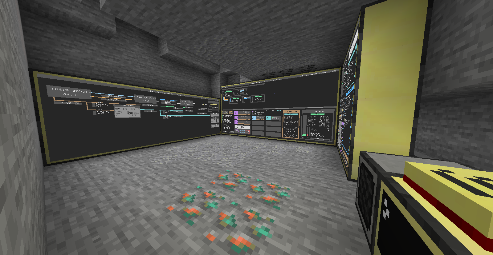
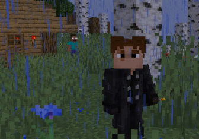

# Главная страница | Game Shard

<figure><figcaption></figcaption></figure>

***

> «Не бойся когда ты один, бойся когда ты ноль.» - ©Джейсон Стетхем
>
> P.S. выводы - учитесь базовым модам.

***

## Что это?

**Game Shard** — это развивающийся игровой проект, стартовавший в августе 2024 года. Сервер прошел интересную эволюцию: начав свой путь как площадка для мини-игр, он трансформировался в полноценный сервер с модами, предлагая игрокам уникальный модифицированный игровой опыт.

***

## История и развитие

Проект был основан с амбициозной целью создать многофункциональное игровое пространство. Первоначальная концепция мини-игр заложила фундамент для дальнейшего роста, а переход на моддинг открыл новые горизонты для сообщества.

***

## Текущее состояние

Сейчас Game Shard работает как сервер с модами, предоставляя игрокам расширенные возможности, которые выходят за рамки ванильного Minecraft. Это позволяет участникам наслаждаться более глубоким и разнообразным геймплеем с дополнительным контентом, механиками и возможностями.

***

## Планы на будущее

Команда Game Shard не останавливается на достигнутом. В разработке находится новое направление — звено с классическими PvP-режимами, включая популярный BedWars и другие мини-игры. Это возвращение к истокам проекта, но уже с учетом накопленного опыта и расширенной аудитории.

Проект демонстрирует гибкость и стремление к развитию, совмещая в себе как модифицированный контент, так и классические игровые режимы, что делает его привлекательным для широкой аудитории игроков.

***

<strong>Скриншоты</strong>

<figure><figcaption>
Ресторан Стасика
</figcaption></figure>

<figure><figcaption>
Демократия
</figcaption></figure>

<figure><figcaption>
S.C.A.D.A.
</figcaption></figure>

<figure><figcaption>
HerPobril
</figcaption></figure>

